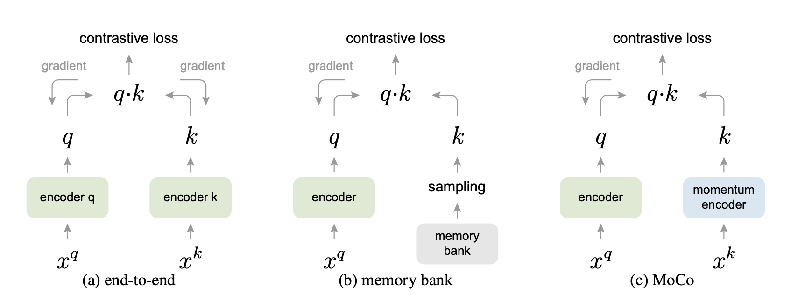

---
tags:
 - self_supervised_learning
 - machine_learning
 - from_paper
---

# Momentum Contrast for Unsupervised Visual Representation Learning

## MoCo as Dual Training

For [[self-supervised-learning]], you can go with something like [[siamese-networks]], whereby you have the same model for all the inputs of the contrastive loss. This makes intuitive sense, because you want to build a "single" representation of images, and so it feels like learning multiple models, only for them to converge to something very similar, is wasteful.

However, many (?) papers opt to not have the models be tied together. For instance, in the above `end-to-end` model, you have one encoder for the "query" and a separate encoder for the "key". Of note is the fact that there is some *asymmetry* here: only the "key" encoder has to encode the negative samples. And yet, it still feels like the two encoders should be doing the same thing.

The one (practical) reason for having separate models (or at the very least different representations) is because there might be advantages for training. 

As hypothesized in the paper, having the same encoder
"caused by the rapidly changing encoder that reduces the key representations’ consistency".