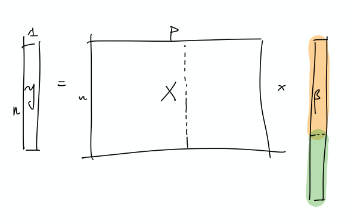
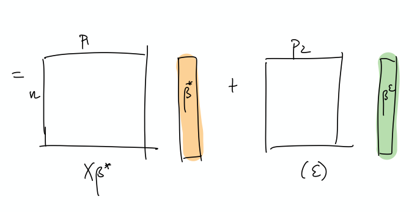

---
tags:
 - from_paper
 - lit_review
 - interpolation
---

# Benign Overfitting in Linear Regression

src: [@Bartlett:2020ck].

- references:
    - [slides](https://www.stat.berkeley.edu/~bartlett/talks/201908Microsoft.pdf), better exposition
    - new paper that generalises this: "Benign overfitting in the large deviation regime", via [arXiv](https://arxiv.org/abs/2003.05838.pdf)
- setting:
    - linear regression (quadratic loss), linear prediction rule
        - <mark>important</mark>: we are actually thinking about the ML regime, whereby there isn't just a *true* parameter, but that there is a *best* one by considering the expectation (which, under general settings, corresponds to what would be the "truth").
        - <mark>important</mark>: they are considering random covariates in their analysis! I guess this is pretty standard practice, when you're calculating things like *risk*
        - that is, you can think of linear regression as a linear approximation to $\mathbb{E} ( Y_i \,\mid\, X_i)$
        - [blog](https://www.timlrx.com/2018/02/26/notes-on-regression-approximation-of-the-conditional-expectation-function/) with a good explanation: very standard classical exposition, showing that the conditional expectation is the optimal choice for $L_2$ loss, and the linear regression solutions is the best linear approximation to the conditional expectation (something like that)
    - infinite dimensional data: $p = \infty$ (separable Hilbert space)
        - though results apply to finite-dimensional
    - thus, there exists $\theta^*$ that minimises the **expected** quadratic loss
        - in order to be able to calculate expected value, they must be assuming some model (normal error)
    - but they want to deal with the interpolating regime, so at the very least $p > n$, and probably >>
    - "We ask when it is possible to fit the data exactly and still compete with the prediction accuracy of $\theta^*$."
        - ~~Unless I'm being stupid, this line doesn't make any sense. If you fit the data exactly, then by definition you're an optimal solution~~
    - the solution that minimises is underdetermined, so there isn't a unique solution to the convex program
    - okay, so I think what they're trying to say is that, if your choice of $\hat{\theta}$ is the one that minimises the quadratic loss (= 0), and then pick the one with minimum norm (what norm), then let's see when do you get good generalizability
    - "We ask when it is possible to overfit in this way – and embed all of the noise of the labels into the parameter estimate $\hat{\theta}$ – without harming prediction accuracy"
- results:
    - covariance matrix $\Sigma$ plays a crucial role
    - prediction error has following decomposition (two terms):
        - provided nuclear norm of $\Sigma$ is small compared to $n$, then $\hat{\theta}$ can find $\theta^*$
        - impact of noise in the labels on prediction accuracy <mark>(important)</mark>
            - "this is small iff the effective rank of $\Sigma$ in the subspace corresponding to the low variance directions is large compared to $n$"
    - "fitting the training data exactly but with near-optimal prediction accuracy occurs if and only if there are many low variance (and hence unimportant) directions in parameter space where the label noise can be hidden"
- intuition: I don't think they've provided much in the way of any intuition about what is going on, so let's see if we can come up with some
    - this is weird because we're thinking of linear regression, and so basically it's a linear combination of the $X$'s to get $Y$.
    - if we were to think about this geometrically, is that we have an infinite dimensional $C(X)$, with sufficient "range"/span that our $Y$ lands in $C(X)$.
    - <mark>I feel like what they're trying to do is basically have the main true linear model, and then what you have are these small vectors in all sorts of directions, so that you can just add those to your solution, in order to interpolate (??)</mark>
        - and since we're dealing with a model that is linear in truth, then
        - I'm confused, because since both $x,y$ are random, then calculating the risk is over both of these things.
- takeaway:
    - basically, the eigenvalues of the covariance matrix should satisfy:
        - many non-zero entries, large compared to $n$
        - small sum compared to $n$ (smallest eigenvalues decays slowly)
        - i.e. lots of small ones, probably some big ones (?)
- summary: this is what I think is going on
    - let's just start with $X$ and it's covariance matrix $\Sigma$: what we have here is something, at the population level, that can be described by a few large eigenvalues, and then many, many small eigenvalues. The idea is that the $\Sigma$ describes the distribution of the sampled $x$ vectors, and so the eigenvalues determine the variability in the direction of the respective eigenvector. However, there is no guarantee that there needs to be a rotation, so it is entirely possible that the variability in the $x$'s are concentrated on individual coordinates.
        - ~~I incorrectly thought that what we have are random vectors, and so this spans all the coordinates, which makes it easier to extract the coefficients~~
    - So what we need are very many small directions of $x$ (again, you can just align them to a coordinate)...
    - The optimal thing would be this nice sort of decomposition, where the first few elements of $\beta$ correspond to the true coefficients. Then, the point is that the error can be entirely captured by a linear combination of the rest of the covariates.
    - 
    - This is a more explicit decomposition of the two terms
    - 
    - The idea here is that, in some simplified sense, the error is just a random Gaussian vector, and we should be able to represent it exactly as a linear combination of a lot of small gaussian vectors.