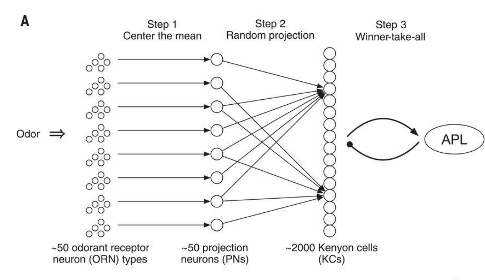
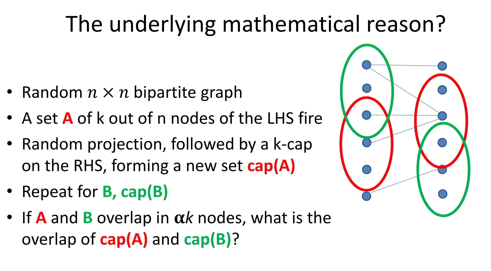
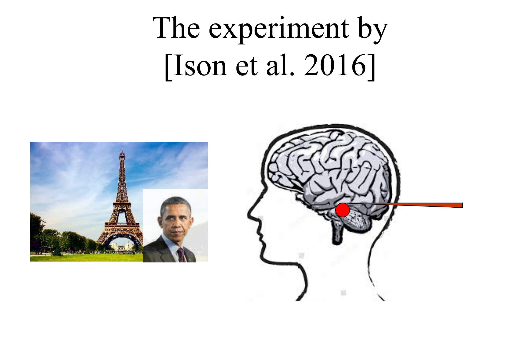

---
tags:
 - neuroscience
 - biologically_inspired
---

src: [video](https://www.youtube.com/watch?v=_sOgIwyjrOA&feature=youtu.be), [pdf](https://simons.berkeley.edu/sites/default/files/docs/14061/rpassemblies.pdf)

 - olfactory *intelligence*: centring -> random projection (50 to 2000) -> sparsification
 - $\mathbb{R}^{50} \to \mathbb{R}^{2000} \to \{0,1\}^{2000}$ (sparsity at the 10% level, thresholding the top).

 - similarity is preserved by this (random-projection+threshold) procedure; similarity here defined by overlap
   + not really sure what you're gaining though? ^[I guess, the idea is that you have a sparse representation (binary vector that can be captured by binary-firing neurons). perhaps storage, like with computers, just has to be in binary, so there's nothing particularly profound here.]

 - Calculus of the Brain
   + interesting experiment: have a neuron only fire when you see Eiffel tower (vs house or Obama)
     * then super-impose Obama onto Eiffel tower, see below
     * now show Obama, and the neuron will fire (most of the time)
   + what's going on?
     * one way you can think of this is that there's the set of neurons that fire for Eiffel (memory of Eiffel), and similarly for other objects
     * when you see two things together (learning relationships, causality, hierarchy), then what happens is that these two sets of neurons are now connected/merged
     * but in order for this to make sense, the merge operation needs to be a little bit elaborate. basically you have to create the merged version (so like Eiffel+Obama), and perhaps that becomes the channel that connects the two things?
   + this basically gives you something like a calculus on the brain, basically involving set operations on neurons

