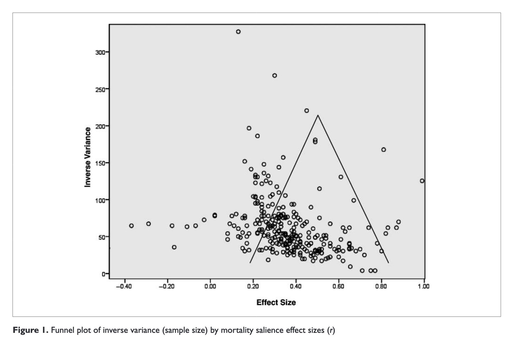

---
tags:
 - from_podcast
 - meta_analysis
 - statistics
---

# Meta Analysis vs Preregistration

src: [Expertise of Death](http://www.theblackgoatpodcast.com/posts/the-expertise-of-death/), Black Goat Podcast

>  How important is expertise in conducting replications? Many Labs 4 was a large, multi-lab effort that brought together 21 labs, running 2,220 subjects, to study that question. The goal was to compare replications with and without the involvement of the original authors to see if that made a difference. But things got complicated when the effect they chose to study – the mortality salience effect that is a cornerstone of terror management theory – could not be replicated by anyone.

The somewhat crazy thing is that a comprehensive meta-analysis was conducted for terror management theory, via [@Burke:2010ij]. In particular, it was "164 articles with 277 experiments". That's a lot of experiments. Things like funnel plots don't help either.

The important question is: are there any meta-analysis techniques that would be able to flag something wrong with these experiments? I'm pretty sure the answer here is no. Though, I would loved to be proved wrong. As one of the podcasters remarked, doing a meta-analysis cannot beat doing a large preregistered study.

The problem with meta-analyses is that they assume that the $p$-values are drawn from the true distribution, without any bias or problems with the experimental design. But that's an unreasonable assumption. What is the point of a meta-analysis if not to help combat this replication crisis? I thought the point was that you're able to detect cases of $p$-hacking.