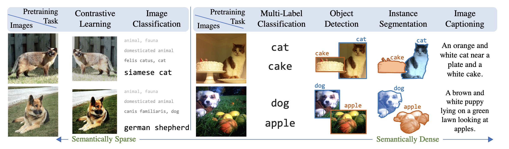

# Multi-Modal Learning

It seems like we spend a lot of time working in these different seemingly disparate learning domains: supervised, self-supervised, multi-modal supervised [@desai2021virtex]. However, it feels to me like the goal should be to be able to be **agnostic** to the form (which feels a little like what the Perceiver paper in [[generalised-neural-networks]] was trying to accomplish).

What would that mean in the case of images? I quite liked the figure below, which talks about *semantic density*. In some sense, they're different views of the same representation (though of course the image is the most "complete", and usually what we care about is starting from images; though one might also want to be able to learn the inverse mapping, from label to image).

It almost feels like some kind of ensemble, or crowd-sourcing problem, whereby image captioning can be thought of as the gold standard, providing a lot of semantic information, and the crops from contrastive learning much weaker and noisier "labels".