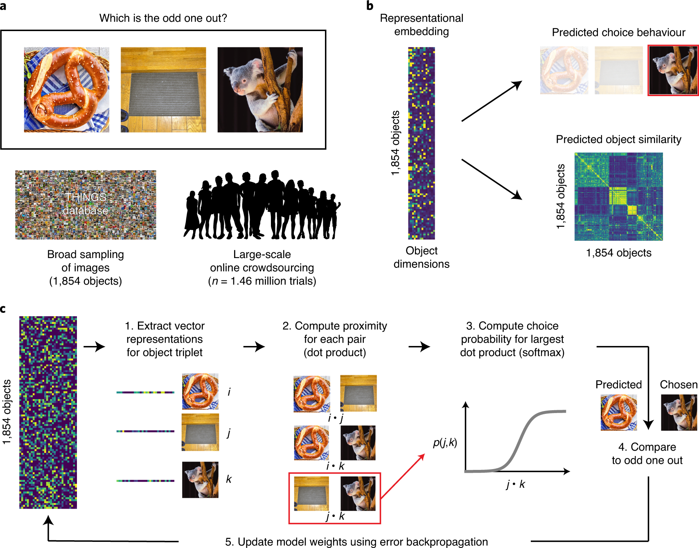
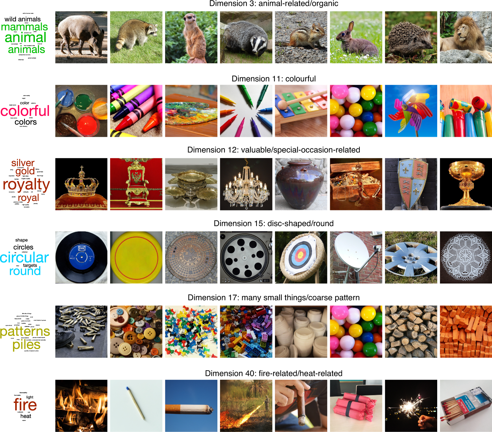
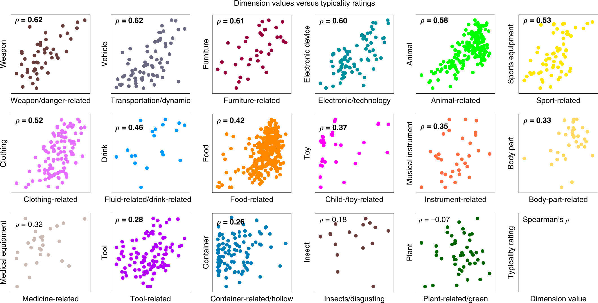

---
tags:
 - paper
 - psychology
---

# Multidimensional Mental Representations of Natural Objects

 - src: [@Hebart:2020uz]
 - [arXiv](https://psyarxiv.com/7wrgh/)
 - [ICLR](https://arxiv.org/abs/1901.02915) (earlier version)

## Contemplations

### Distributed Representation

The idea of "distributed representation" (`word2vec`) is that a) words are represented as high-dimensional vectors, and b) words that cooccur should be closer together. What this means is that you can simply ingest a large corpus of unstructured text, collecting co-occurrence data, and learning a distributed representation along the way. The beautiful thing about this approach is that the only thing it relies on is some notion of co-occurrence; in the case of language, this is simply a window function.

What happens when you don't have such information? Well then, you have to get a little creative. For those familiar with `word2vec`, you'll know that a lesser-known but powerful trick they proposed is this notion of *negative sampling*: they found that it wasn't enough to, during the traversal of your corpus and training your model, to push co-occurring words together, but it was also important to push words apart (i.e. randomly pick a word, and then do the opposite maneuver). Note the similarity to [[triplet-loss]]. In essence, we can move from pairs to triplets. But this seems like we've made the problem even more difficult.

As it turns out, the triplet structure allows us do something interesting, which is to turn the problem into an "odd-one-out" task. Cute!^[Dwelling on this a little longer, the paired version would be more like, show pairs to people and ask if they should be paired, which feels like an arbitrary task. The alternative, which is to give a rating of the similarity, naturally inherits all the ailments that come with analyzing ratings.] In other words, given a corpus of images of objects, we can show a random triplet of them to humans, and ask which one is the odd one out. All that remains is to train our models with this triplet data. Here, they adapt `softmax` to this problem, applying it only to the chosen pair:

$$
\sum_{(i,j,k)} \log \frac{ \exp\left\{ x_i^T x_j \right\} }{ \exp\left\{ x_i^T x_j \right\} + \exp\left\{ x_i^T x_k \right\} + \exp\left\{ x_j^T x_k \right\}} + \lambda \sum_{i = 1}^{m} \|x_{i}\|_{1},
$$

where the first summation is over all triplets, but, crucially, we designate $(i,j)$ to be the chosen pair (i.e. $k$ is the odd one out). The $l_1$ penalty induces sparsity on the vectors, which improves interpretability. Finally, and I'm not sure exactly how they implement this, but they also enforce the weights of the vector to be positive, to provide an additional modicum of interpretability.^[I feel like they overemphasize these two points, sparsity and positivity, as a way to differentiate themselves from other methods, when it's really quite the trivial change from a technical perspective.]

What is the output of this model? Ostensibly, it is a "distributed representation" of how we as humans organize our understanding of objects, albeit also conflating the particulars of the image used to represent this object.^[Does the prompt ask the subject to consider the image as an archetype, or simply ask to compare the three images on face value, whatever they see fit? My guess is probably the latter.] Note that even though we're dealing with the visual domain, the open-endedness of the task means that humans aren't necessarily just using visual cues for comparison, but might also be utilizing higher order notions.

A crude approximation is that this model outputs two types of *features*: visual properties, like size, texture, etc.; and then the more holistic, higher-order properties, such as usage, value/price, etc. The key is that the latter property should not be able to be inferred from visuals alone.^[So really what I'm saying is that there are two groups, $V$ and $V^C$. Not groundbreaking.] Thus, this model is picking something intangible that you cannot possibly learn from simply analyzing image classification models. However, this then begs the question: is it possible to learn a similar model by considering a combination of images (visual features) as well as text (holistic features)? What would be the nature of such a multi-modal learning model?

I see a few immediate challenges. The first is that, while one could take the particular image chosen in this experiment to represent an object, it would be too specific. What we would want is to be able to learn a single feature across all images of a single object. I feel like this should be something people have thought about, right? The second problem is, are word embedding of the objects sufficient to get the higher-order features? 
Supposing we solve all those problems, we're still left with the question of how to combine these two things meaningfully. It feels to me like we should be training these things in unison?

### Typicality

The idea here is that the magnitude of a particular dimension should import some meaning, the most likely being the *typicality* of this object to this particular feature (e.g. food-related). What they do is pick 17 broad categories (the graphs below) that have a corresponding dimension in the vector representation, then for each image/object in this category (e.g. there are 19 images in the Drink category, corresponding to 19 points on the graph), they get humans to rate the typicality of that image for that category.

This result is somewhat surprising to me. For one, if you give me a list of images for, say, the category of animals, I would have no idea how to rate them based on *typicality*. Like, I think it would involve something cultural, regarding perhaps the stereotypes of what an animal is. I can imagine there being some very crude gradation whereby there are the clear examples of atypical, and then clear examples of typical, and then the rest is just a jumble. It doesn't really appear that way from the data – I would have to look at these images to get a better sense.^[As an aside, I wish they also included the values of all the other images too, not just those in this category. Perhaps they are all at close to zero, which would be great, but they don't mention it, so I assume the worst.]

Also, how is it able to get at typicality through this model? I think what's illuminating to note is that, out of the 27 broad categories of images in this dataset, 17 can be found in the 49-dimensional vector representation. Here's what I think is probably happening (in particular for these 17 categories):

 - if all three images are from different categories, then probably we're learning something about one of those other dimensions (hopefully);^[Another thing is that this step helps to situate the categories amongst each other.]
 - if two images are from the same category, and the third is different, then the same pair is most often picked (helping to form this particular dimension);
 - if all three images are picked, then I guess the odd one out is the one that's the least *typical*.

Having laid it out like so, I'm starting to get a little skeptical about the results: it almost feels like this is a little too crude, and the data is not sufficiently expressive for a model to be able to learn something that's not just trivial. Put another way, this almost feels like a glorified way of learning the categories – though, there's nothing necessarily wrong with that, since the (high-level) categories are obviously important.

Perhaps it helps to consider the following generative model for images: suppose each image was represented by a sparse vector of weights, with many of the coordinates corresponding to broad categories. Set it up in a such a way that if you're in a broad category, then that dominates all other considerations (so it follows the pattern above). Then, simply run this odd-one-out task directly on these vectors, and see if you're able to recover these vectors.^[It almost feels like a weird autoencoder architecture...]