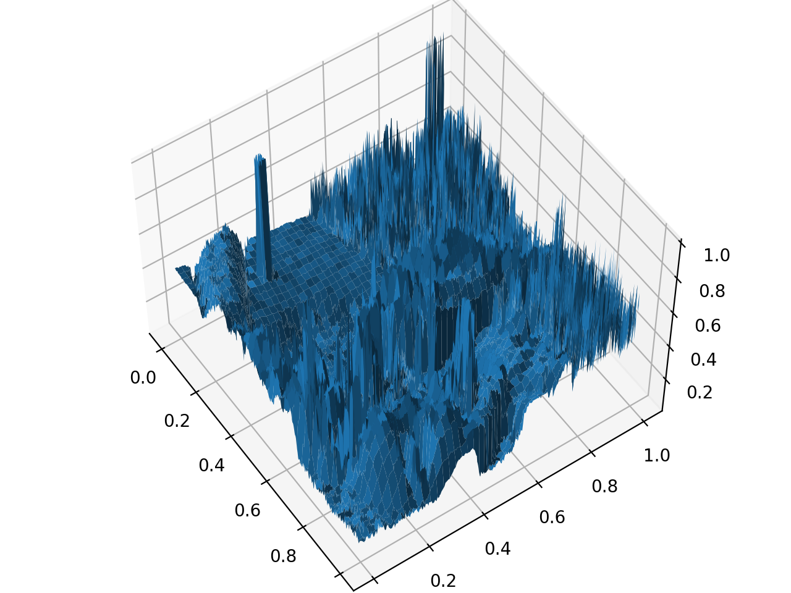

---
tags:
 - neural_networks
 - from_paper
---

# Neural Representations

src: [@sitzmann2020implicit]

Consider the following (seemingly contrived) problem: learn the function $f:\mathbb{R}^2\mapsto \mathbb{R}^3$ that takes $(x,y)$ coordinates and outputs the $(r,g,b)$ values of a (fixed) image. In other words, the idea here is to learn a *neural representation* of an image.^[It almost feels like we're talking about compression, but also not quite?]

To begin with, let's use an MLP to learn the function. All we're doing is learning a function from $[0,1]^2$ (first squeeze the image into the unit square) to $[0,1]^3$. Of course, the problem here is that this function is very much not smooth. However, it's also not the extreme case of learning an image of random noise, as there are patterns in the data (and possibly stretches of similar color in the background, for instance). Unsurprisingly, it is difficult for the MLP to learn this "function" – it simply learns a smooth function, which is basically a blurry version of the image.^[One might argue that MLPs are non-linear and so very much not smooth, in a proper functional analysis sense, and they would be right. Here I am using smoothness loosely to mean how bendy the function is (how able it is to interpolate random noise, say).]

Here is where thinking in terms of compression might be helpful. The fact that we can compress most natural images (via representations in different bases) suggests that there should be a way to functionally represent an image in an *efficient* manner. The question is, how can we transform the space so that the function $f$ we're learning is **smooth(er)**? Perhaps unsurprisingly, it turns out that thinking in terms of fourier bases gets you pretty far.

Recall that the idea behind image compression with FFT (great youtube video [here](https://www.youtube.com/watch?v=gGEBUdM0PVc)) is that you can represent an image as a sum of a sparse set of 2D-fourier bases (think 2D periodic waves). That is, most coefficients are negligible, and so you only need a sparse set of coefficients to reproduce the image. One way you can think about this is that you can start with the (deterministic) function $g: \mathbb{R}^2 \mapsto \mathbb{R}^{2k}$ that essentially stacks $k$ 2D-fourier bases, followed by a function $h: \mathbb{R}^{2k} \mapsto \mathbb{R}^3$. that takes a weighted sum of these bases. Note that the size of $k$ depends on the *resolution* of the image – it should be the number of pixels. Putting this together, we have $f = g \circ h$, which is a way of expressing an image through its fourier representation. One interpretation is that we've projected the input into a high-dimensional space, and then simply run a (sparse) linear model (aka [basis pursuit](https://en.wikipedia.org/wiki/Basis_pursuit)).^[Of course, when you actually do the FFT/DCT, you don't actually solve the linear model.]

<Note>
Note that actually, with a complete fourier basis, we've taken things to the extreme, so that the final function to be "learned" is the smoothest function possible, a linear one. After all, that is the point of using a complete basis – everything else is just linear combinations. It's just that the fourier basis elicits a sparse representation, whereas other bases might not be.
</Note>

Now, suppose we wanted to learn $f$ in a more data-driven manner. Let's reduce the expressivity of $g$, while increasing the expressivity of $h$. In some sense the true $g$ already has lower expressivity (you only need the sparse set of basis functions), but that is data-dependent, so we can't really take advantage of that. We can replace the linear model $h$ with an MLP $h'$, and counterbalance that with a less expressive $g'$. How do we make a less expressive $g'$ that roughly approximates the original $g$? A simple solution is to simply pick a random subset of the basis functions (though perhaps it might make more sense to actually strategically pick basis functions). And that, in a "nutshell" is what [@sitzmann2020implicit] proposes.

## IO

What's interesting to me about this problem is that it harks back to a bygone era, where life revolved around function approximation. While, yes, everything is function approximation, there is a stark contrast between classic function approximation and say classifying images:

1. I don't know how important this point is, but the fact that the data is dense in the input space. This is clearly very different from image classification, where the data distribution of natural images is oftentimes considered as a low-dimensional manifold of the full input space.
2. This gets us back to [[classification-vs-regression]]!

## Ideas

### Generative Models

Many generative (image) models (like [[variational-autoencoders]]) perform roughly the same operation: starting from a "latent" representation, they then learn a function at the pixel level, as opposed to just learning a very high-dimensional vector. It feels like there should be something to be gained from expressing images through fourier bases here. In particular, I think a problem early on was that the results of these generative models were very smooth, which sounds exactly like this problem.

On the other hand, just because something elicits a sparse representation doesn't necessarily make it good, especially when we're dealing with higher-level representations (which in some sense latent variable models strive for). It's almost a little like, there already exists a *natural bottleneck*, but we're not going to use it, since that bottleneck is simply capturing the redundancies of natural images, and nothing particularly helpful from an ==interpretable perspective==.

 - [ ] This makes me wonder, are latent representations of images just learning fourier features? Probably not, right, since the fourier representation is highly periodic/non-regular.
 - [ ] I imagine there are multiple routes to latent representations. One can imagine trying to learn "independent" latent representations (it's a little like what they do in [@bardes2021vicreg] for [[self-supervised-learning]], except at the representation level), with the goal of finding the best one. Another way to think about it is that, latent variable learning will often find the easiest route (and so I imagine it won't get to fourier in a data-driven manner) – perhaps adding some "feature engineering" will produce better latent representations

## Open Questions

  - [ ] Is the performance a function of the total power (sum of magnitude/weights) of the fourier spectrum?
  - [ ] Assuming random noise is dense in the fourier domain, we should expect the fourier basis to be similar in performance to other complete bases? The idea is that random noise is not smoother with any sort of projection.
  - [ ] Is random picking better than grid/strategic picking?