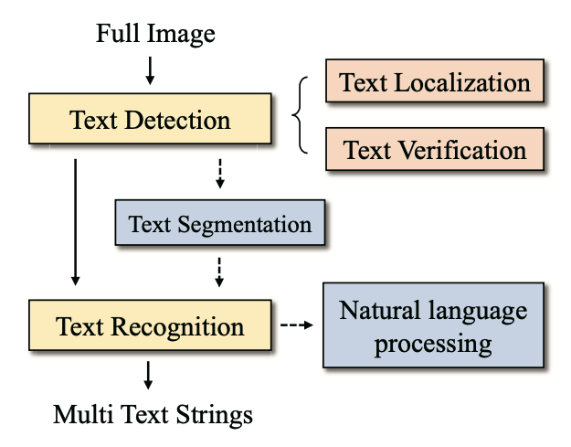
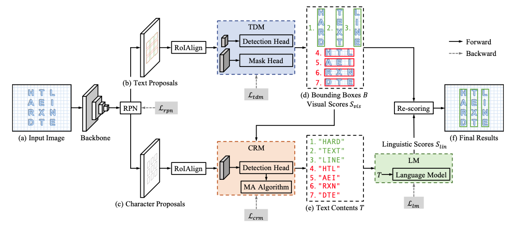

# Text Recognition Literature Review

## Text Recognition in the Wild: A Survey

 - Text Localisation (aka text detection)
	 - Early methods used low-level features such as color, gradient, stroke width transform, [maximally stable extremal regions (MSER)](https://en.wikipedia.org/wiki/Maximally_stable_extremal_regions), canny detector, conected component analysis.
 - Text Verification: checking whether or not candidate "boxes" actually contain text
	 - Again, this feels a little like Fast RCNN, where you're given a bunch of "Regions of Interest"(RoI), and the CNN then tries to classify the object; nowadays we don't really need a separate step for this.
	 - Early methods used SVMs, CRFs.
 - Text Segmentation: considered one of the most challenging parts
	 - line segmentation (multi-line into separate lines)
	 - character segmentation (breaking down into characters, which as pointed out by Alex is essentially what the bounds model does): early text recognition approaches opted for this technique.
 - Text Recognition:
	 - Early methods include histogram of oriented gradients descriptors, connected components, stroke width transform.
 - End-to-end systems:

## AE TextSpotter

TDM: outputs are *text-line* bounding boxes and visual scores. There's a detection head and a mask head.
CRM: output are bounding boxes and character classes.

Then, there's a matching algorithm that matches characters to lines, so you can produce the text content of a line.

LM: they use the language model only as a filtering step (on top of a NMS that happens after the "score" is produced). That is, once you have the candidate text contents (e), the LM will give a score, which you combine with the "visual score". They also train the LM separately from the rest of the model (not sure why) as a two-stage model.

Thus, it's main purpose is to handle two rather estoric problems: chinese characters being either vertical or horizontal; and large spacing of characters causing the "words" to be split up. Perhaps this last problem might be useful for us when we have ambiguous spacing, but that error doesn't appear to be particularly damning for us right now.
