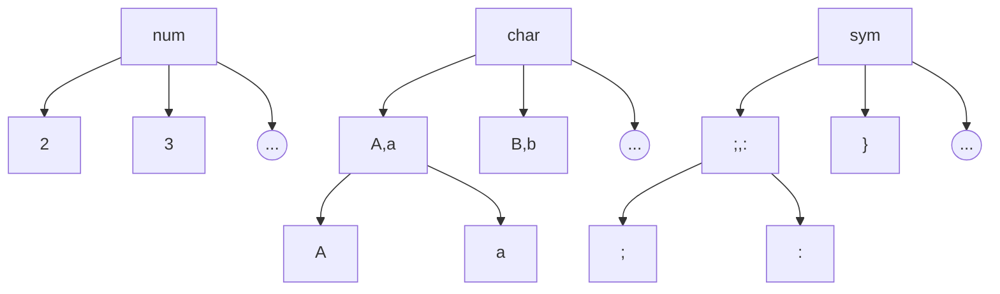
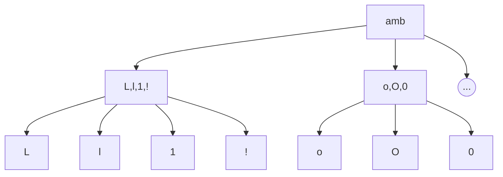

# Text Recognition

## Differentiation / Data

How we differentiate ourselves from existing services?

Currently, we are relying on the fact that we are dealing with GUIs, so we essentially have pixel-perfect font renderings. You can think of things as a spectrum: on the left we have our setting; in the middle we have things like scanned documents, where text is fairly uniform, though there are artefacts and noise introduced by the scanning procedure and others; finally you have the general problem of recognising text in the "wild" (e.g. street signage from photographs).

One might be tempted to create something that handles all possible situations.^[One might assume that solving the problem of text in the "wild" would suffice for the rest, as they are simpler problems, but just like in the case of line detection, SOTA text recognition models don't always perform that well on our simple GUI data.] However, it is unclear from our use-case if or when we will ever need to extend our OCR capabilities to the more general setting (and if or when that time comes, we can always run two models in parallel or something).

So I think for the purposes of our current implementation, we can safely assume that we will be reading rendered text on screenshots, the kind that is usually found in applications.

### To Column or not to Column

One of the nice things about rendered text on a screen is that you get some structure for free:
 - you can essentially assume that your text is exactly horizontal (there's no incline, or other weird orientations to have to worry about).
 - if you ignore things like italics, you can assume that characters occupy some contiguous set of columns, enabling you to make column-level predictions.^[Actually, this makes me think that somewhere the model should definitely be able to use the fact that characters are of a certain consistent range of relative width (though capital letters might throw things off).]
At the same time, you can probably break down more sophisticated models into a "pre-processing" step that turns weirdly oriented sequences of characters into some baseline horizontal orientation, maybe even normalized by size. Once you've done that, then we're basically on starting from the same position.

Aside: I think it would also be useful to think more broadly in terms of languages. For instance, there are right-to-left languages (which doesn't really matter, except that your language model is now reversed); and then you have things like chinese with their characters (this may be out of scope for now, given the explosion in the number of "character" classes).

### (Implicit) Language Model

Currently, we're doing character level predictions, and our receptive field is roughly enough to probably see one character each side usually. On the other hand, most SOTA models now use some kind of decoder/sequence model (e.g. LSTM), allowing for longer-range dependence and hence (character-level) "language models".

It's an interesting question, whether or not having a language model would be better for us. At the end of the day, it boils down to evaluating the kinds of errors our models are making and would be better solved with a language model, and counterbalancing that against the kinds of biases that might be introduced, especially when dealing with serial numbers that have more arbitrary character sequences.

The way I would interpret our dataset distribution is as follows:

1. We have the actual GUI text which are English words (i.e. dictionary words).^[Though actually we should probably start thinking about other languages.]
2. Then we have things like person or company names, dates, numbers. These usually are input fields (and so in theory one could either have that be part of the input, or learned from the form label).
3. Finally, we have things like ids, serial numbers that might contain a mix of numbers and characters; free-form inputs (like comments), where there might be punctuation/symbols.

Most of the text will be the application text (which would most likely be used for either navigating, via buttons or menus, or used indirectly as anchors). We should be getting those right, but one could argue that getting those things wrong might matter a little less, because we're not "reading" from them, and so it's much more difficult to have **silent failures**. On the other hand, the other categories might not be as common in terms of what text is seen on the actual screen, but it is definitely more likely to be chosen and interacted with.

Key point: there's an important distinction between what text will be seen on a screen, and what text will need to be interacted with; even if most text on a screen are application text (like field labels), many if not most of those texts won't actually be read. Easy to forget this.

Update: having had a look a little closer at our "dataset", I'm finding it hard to find instances where you might have actually random characters (like you get in random password generators, and what we generate in our synthetic data).

## First Principles Thinking

The learnings from recent advances in SOTA ML is that seemingly difficult problems (say really long time horizons in RL) don't actually need a completely new architecture (say hierarchical RL).^[A quote from https://openai.com/blog/openai-five/.] Data/feature/model engineering is not as effective as giving your model more capacity, to figure out things for itself.

That being said, we're not in the same regime as these kinds of open-ended problems. We are dealing with a very *constrained* problem, and we already know the pitfalls/difficulties that befall our models. At the same time, because it is so constrained, it feels more plausible that injecting some architectural biases will be helpful.

In some simple sense, there's no free lunch in machine learning: you either get your learnings from your data, or you get your learnings from your human overlords that inject some inductive biases. And if you don't have infinite *real* data, but synthetic data, then you're just getting your learnings from how you generated your synethic data.

### Upper/Lower Case

There are fonts out there where lower and upper-case only differ by size/scale (technically if we knew line-height then we could differentiate, but we rarely do). Interestingly, this means we should be:

 - globally scale-invariant (font-size invariant)
 - locally scale-sensitive (upper/lower-case)

Actually, we (and most recognition techniques) solve the first by normalizing the size of the input. Thus, in terms of the *recognition* part, we don't need any scale-invariance (the *detection* part should still have invariance since scaling doesn't solve the problem there).

Let's actually go through a few examples:

 - v vs V
	 - 
 - b vs B
	 - 

 - abcdefghijklmnopqrstuvwxyz
 - ABCDEFGHIJKLMNOPQRSTUVWXYZ

### Character Classes

Inspired (somewhat) by the way FasterRCNN works (first predict *objectness*, then predict the class), I think it might make sense to inject some additional inductive bias into the character classes themselves.

Firstly, we should distinguish between the three broad categories of characters: alphabet, numeric, symbols. The main reason for this is because the signature of their presence in a "word" gives lots of information about what kind of "word" we're looking at. For instance, if you have numbers interspersed with characters, then most likely you're dealing with a symbol, in which case you should assume all characters are independent. On the other hand, if you have a bunch of characters, then we might want to assume things like capitals really only happen at the beginning of words.

### Ambiguous Cases

I'm now thinking that we should go one step further in "feature engineering", and actually handle confusing/ambiguous characters separately. One way to do this would be to have, in addition to the three broad categories (char, num, sym), we also have the ambiguous group (note that ambiguous characters are almost always across groups (`O` and `0`; and this doesn't include the upper/lower case confusion).

One problem with this method is that it forces the model to put things like `L` and `l` together, when they only should be together for certain fonts (or `A` and `a`).

In an ideal world, we would make the model learn these kinds of groupings. That being said, an *embedding* approach feels a little like this. For instance, the idea would be that `A` and `a` have close embeddings. However, I go back to the fact that we just don't have that much data – so it probably pays to try to inject these biases manually.

## Transformers (Huggingface)

TODO

## Random Ideas

 - Lower/Upper case predictor (separate head)
 - Character+Bounds -> sequence (similar to what Anindya had in mind before)
 - We can think about bounds as a detection model