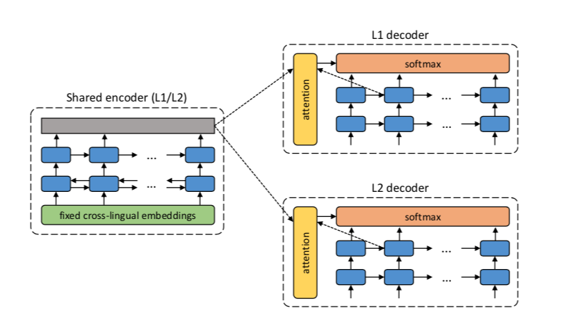

---
tags:
 - research
 - nlp
 - from_paper
---

# Unsupervised Language Translation

Two papers:

 - Word translation without parallel data. [OpenReview](https://openreview.net/forum?id=H196sainb) [@Conneau:2017wg]
 - Unsupervised Neural Machine Translation. [OpenReview](Unsupervised Neural Machine Translation) [@Artetxe:2017ta]

## Unsupervised Neural Machine Translation

Typically for machine translation, it would be a supervised problem, whereby you have parallel corpora (e.g. UN transcripts). In many cases, however, you don't have such data. Sometimes you might be able to sidestep this problem if there's a bridge language where there does exist parallel datasets. What if you don't have any such data, and simply monolingual data? This would be the unsupervised problem.

1. They assume the existence of an **unsupervised cross-lingual embedding**. This is a key assumption, and their entire architecture sort of rests on this. Essentially, you form embedding vectors for two languages separately (which is unsupervised), and then *align* them algorithmically, so that they now reside in a shared, bilingual space.^[It's only a small stretch to imagine performing this on multiple languages, so that you get some notion of a universal language space.]
2. From there, you can use a **shared encoder**, since the two inputs are from a shared space. Recall that the goal of the encoder is to reduce/sparsify the input (from which the decoder can reproduce it) -- in the case of a shared encoder, by virtue of the cross-lingual embedding, you're getting a language-agnostic encoder, which hopefully gets at *meaning* of the words.
3. Again, somewhat naturally, this means you're basically building both directions of the translation, or what they call the **dual structure**.
4. Altogether, what you get is a pretty cute autoencoder architecture. Essentially, what you're doing is training something like a [[siamese-networks]]; you have the shared encoder, and then two separate decoders for each language. During training, you're basically doing normal autoencoding, and then during inference, you just *flip* -- cute!
5. To ensure this isn't a trivial task, they take the framework on the denoising autoencoder, and shuffle the words around in the input.^[I'm so used to bag-of-word style models, or even the more classical word embeddings that didn't care about the ordering in the window, that this just feels like that -- we're harking back to the wild-wild-west, when we didn't have context-aware embeddings.] I guess it's a little difficult to do something like squeeze all these tokens into a smaller dimension. However, this clearly doesn't do that much -- it's just scrambling.
6. The trick is then to adapt the so-called back-translation approach of [@sennrich-etal-2016-improving] in a sort of alternating fashion. I think what it boils down to is just flipping the switch during training.
7. Altogether, you have two types of mini-batch training schemes, and you alternate between the two. The first is same language (L1 + $\epsilon$ -> L1), adding noise. The second is different language (L1 -> L2), using the current state of the NMT (neural machine translation) model as the *data*.

## Word Translation Without Parallel Data

1. With the similar constraint of just having two monolingual corpora, they tackle step zero of the first paper, namely how to align two embeddings (the unsupervised cross-lingual embedding step). They employ *adversarial training* (like GANs).^[And in fact follow the same training mechanism as GANs.]
2. A little history of these cross-lingual embeddings: [@Mikolov:2013tp] noticed structural similarities in embeddings across languages, and so used a parallel vocabulary (of 5000 words) to do alignment. Later versions used even smaller intersection sets (e.g. parallel vocabulary of aligned digits of [@artetxe-etal-2017-learning]). The optimisation problem is to learn a linear mapping $W$ such that^[It turns out that enforcing $W$ to be orthogonal (i.e. a rotation) gives better results, which reduces to the Procrustes algorithm, much like what we used for the dynamic word embedding project.] $W^\star = \arg\min_{W \in M_d (\mathbb{R})} \| W X - Y \|_{F}$.
3. Given two sets of word embeddings $\mathcal{X}, \mathcal{Y}$, the discriminator tries to distinguish between elements randomly sampled from $W\mathcal{X}$ and $\mathcal{Y}$, while the linear mapping $W$ (generator) is *learned* to make that task difficult.
4. Refinement step: the above procedure doesn't do that well, because it doesn't take into account word frequency.^[Why don't they change the procedure to weigh points according to their frequency then?] But now you have something like a supervised dictionary (set of common words): you pick the most frequent words and their mutual nearest neighbours, set this as your *synthetic dictionary*, and apply the Procrustes algorithm to align once again.
5. It's pretty important to ensure that the dictionary is correct, since you're basically using that as the *ground truth* by which you align. Using $k$-NN is problematic for many reasons (in high dimensions), but one is that it's asymmetric, and you get hubs (NN of many vectors). They therefore devise a new (similarity) measure, derived from $k$-NN: essentially for a word, you consider the $k$-NNs in the other domain, and then you take the average cosine similarity. You then penalise the cosine similarity of a pair of vectors by this sort-of neighbourhood concentration.^[Intuitively, you penalise vectors whose NN set is concentrated (i.e. it's difficult to tell who is the actual nearest neighbour).]

## Post-Thoughts

It is interesting that these two papers are tackling the same, but different stages, of the NMT pipeline. In hindsight, it would have made much more sense to read the second paper first.

 - *Alternating minimisation* is a common strategy in many areas of computer science. For the most part (at least in academia), it's application is limited by the difficulty
